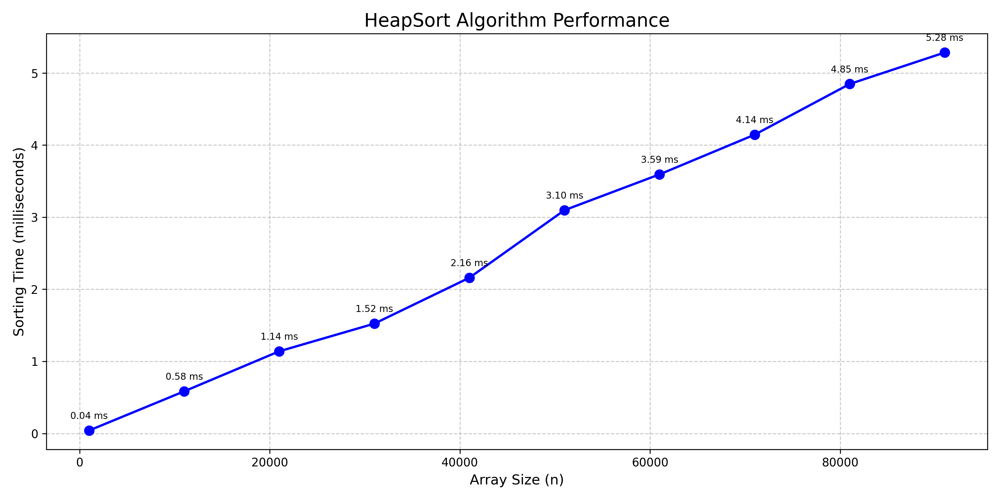
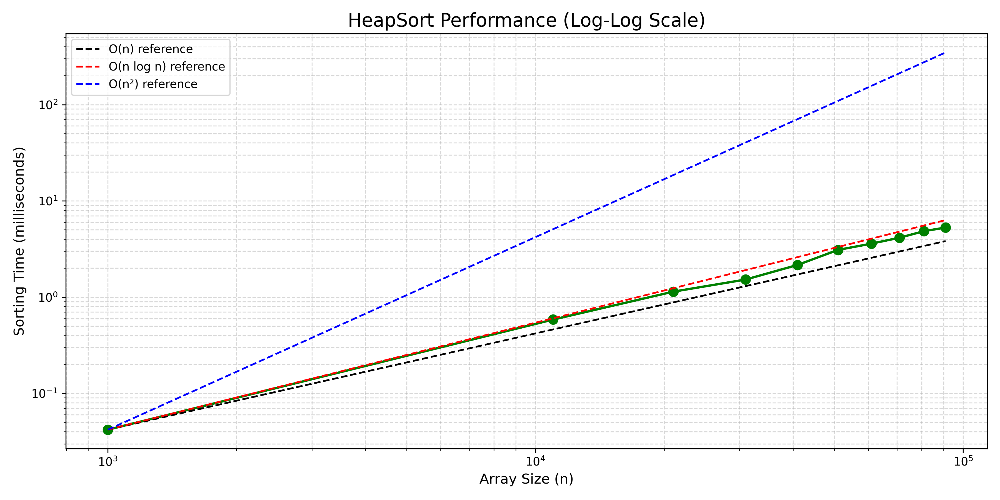
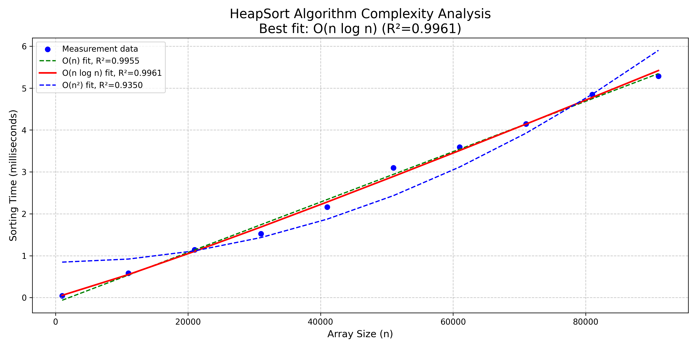

# Heapsort + Performance Measurement Tools

This project implements a heapsort algorithm with comprehensive performance measurement tools, as well as a random number generator utility. It includes features for timing sort operations, conducting benchmarks, and visualizing algorithm performance.

## Table of Contents

- [Basic Usage](#basic-usage)
- [Using the Programs](#using-the-programs)
  - [Heapsort](#for-heapsort)
  - [Random Number Generator](#for-gen_randf)
- [Performance Measurement](#performance-measurement)
  - [Timing Output](#timing-output)
  - [Benchmark Utility](#benchmark-utility)
  - [Visualization Tools](#visualization-tools)
- [Benchmark Results](#benchmark-results)
- [Makefile Commands](#makefile-commands)
- [VS Code Integration](#vs-code-integration)

## Basic Usage

1. **Build all programs**:

   ```sh
   make
   ```

2. **Build specific programs**:

   ```sh
   make heapsort
   make gen_randf
   make benchmark
   ```

3. **Clean the build**:

   ```sh
   make clean
   ```

## Using the Programs

### For heapsort

1. **Sort numbers directly from command line**:

   ```sh
   ./bin/heapsort 5 2 9 1 7 4
   ```

2. **Sort numbers from an input file**:

   ```sh
   ./bin/heapsort -f input/randnum_ea6c2b8b5c51682f.txt
   ```

3. **Sort and save to output file**:

   ```sh
   ./bin/heapsort -f input/randnum_ea6c2b8b5c51682f.txt -o sorted.txt
   ```

4. **Time-only mode (for benchmarking)**:

   ```sh
   ./bin/heapsort -f input/randnum_ea6c2b8b5c51682f.txt --time-only
   ```

   This outputs only the sorting time, useful for benchmarking.

### For gen_randf

1. **Generate default random numbers** (100 numbers between 1-1000):

   ```sh
   ./bin/gen_randf
   ```

2. **Generate a specific number of random values**:

   ```sh
   ./bin/gen_randf -c 500
   ```

3. **Specify range for random numbers**:

   ```sh
   ./bin/gen_randf -c 200 -min -100 -max 100
   ```

## Performance Measurement

The project includes comprehensive tools for measuring and analyzing the performance of the heapsort algorithm.

### Timing Output

All sort operations automatically include timing information that measures **only the sorting algorithm** (not file I/O or other operations). The time is displayed in appropriate units (ns, μs, ms, or s) based on the magnitude:

```
Sorting algorithm performance: Sorted 1000 items in 1.25 ms
```

### Benchmark Utility

The benchmark utility tests heapsort performance across a range of array sizes:

1. **Run benchmark with default settings**:

   ```sh
   make run-benchmark
   ```

   This tests array sizes from 1,000 to 100,000 elements in steps of 10,000.

2. **Run custom benchmark**:

   ```sh
   make run-custom-benchmark
   ```

   This runs a custom benchmark with different size ranges and steps.

3. **Specify custom benchmark parameters**:

   ```sh
   ./bin/benchmark --min 500 --max 10000 --step 500 --repeats 5
   ```

   Parameters:
   - `--min`: Minimum array size
   - `--max`: Maximum array size
   - `--step`: Size increment between benchmarks
   - `--repeats`: Number of repetitions for each size (for more accurate measurements)

Benchmark results are saved to CSV files in the `benchmark_results` directory.

### Visualization Tools

A Python script is included to visualize benchmark results:

```sh
python3 visualize_benchmark.py
```

This creates three visualizations in the `benchmark_plots` directory:

1. **Sort Time Plot**: Shows sorting time vs. array size
2. **Log-Log Plot**: Log-log scale plot to help identify algorithmic complexity
3. **Complexity Analysis**: Curve fitting to determine the algorithm's time complexity

## Benchmark Results

Below are sample visualizations of the HeapSort algorithm performance based on benchmark data:

### Sort Time Plot

This plot shows the direct relationship between array size and sorting time in milliseconds.



### Logarithmic Scale Analysis

This log-log plot helps visualize the algorithmic complexity by comparing the actual performance against reference complexity lines (O(n), O(n log n), O(n²)).



### Complexity Analysis

This analysis uses curve fitting to determine which complexity class best describes the algorithm's performance. As expected for HeapSort, the O(n log n) curve typically provides the best fit.



## Makefile Commands

In addition to the basic commands, the Makefile includes:

```sh
# Build the benchmark utility
make benchmark

# Run benchmark with default settings
make run-benchmark

# Run benchmark with custom settings
make run-custom-benchmark

# Clean all generated files
make clean
```

## VS Code Integration

The project includes VS Code configuration files in the `.vscode` directory:

- **tasks.json**: Defines build and benchmark tasks
- **launch.json**: Configures debugging for all programs
- **c_cpp_properties.json**: Sets up IntelliSense for C/C++
- **settings.json**: Additional editor settings

To use the VS Code integration:

1. Open the project folder in VS Code
2. Press `Ctrl+Shift+B` (or `Cmd+Shift+B` on Mac) to build
3. Press `F5` to run with debugging
4. Use the Run and Debug panel to select different launch configurations
5. Use the Terminal menu to execute tasks like benchmarking
